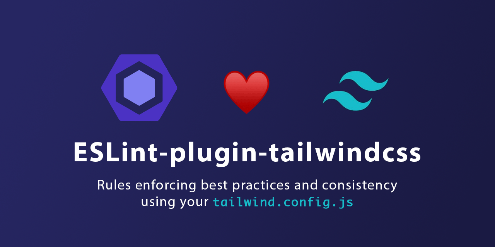

# eslint-plugin-tailwindcss

 



Rules enforcing best practices and consistency using [Tailwind CSS](https://tailwindcss.com/).

While you can use the official plugin [`prettier-plugin-tailwindcss`](https://www.npmjs.com/package/prettier-plugin-tailwindcss) for ordering your classnames...

**`eslint-plugin-tailwindcss` offers more than 5 other rules, that you can benefit from on top of `prettier-plugin-tailwindcss`. Sounds good ? Keep reading 👇**

## Supported Rules

Learn more about each supported rules by reading their documentation:

- [`classnames-order`](docs/rules/classnames-order.md): order classnames by target properties then by variants (`[size:][theme:][state:]`)
- [`enforces-negative-arbitrary-values`](docs/rules/enforces-negative-arbitrary-values.md): make sure to use negative arbitrary values classname without the negative classname e.g. `-top-[5px]` should become `top-[-5px]`
- [`enforces-shorthand`](docs/rules/enforces-shorthand.md): merge multiple classnames into shorthand if possible e.g. `mx-5 my-5` should become `m-5`
- [`migration-from-tailwind-2`](docs/rules/migration-from-tailwind-2.md) for easy upgrade from Tailwind CSS `v2` to `v3`.
  Warning: at the moment you should [temporary turn off the `no-custom-classname`](https://github.com/francoismassart/eslint-plugin-tailwindcss/issues/88) rule if you want to see the warning from `migration-from-tailwind-2`
- [`no-arbitrary-value`](docs/rules/no-arbitrary-value.md): forbid using arbitrary values in classnames (turned off by default)
- [`no-custom-classname`](docs/rules/no-custom-classname.md): only allow classnames from Tailwind CSS and the values from the `whitelist` option
- [`no-contradicting-classname`](docs/rules/no-contradicting-classname.md): e.g. avoid `p-2 p-3`, different Tailwind CSS classnames (`pt-2` & `pt-3`) but targeting the same property several times for the same variant.

Using ESLint extension for Visual Studio Code, you will get these messages


You can can the same information on your favorite command line software as well.

## 🤝 Support `eslint-plugin-tailwindcss`

|                                                                                                                                                                                                                                       |                                                                                                                                                                                                                                                                                                                                                                                                                                                                                                                                                |
| ------------------------------------------------------------------------------------------------------------------------------------------------------------------------------------------------------------------------------------- | ---------------------------------------------------------------------------------------------------------------------------------------------------------------------------------------------------------------------------------------------------------------------------------------------------------------------------------------------------------------------------------------------------------------------------------------------------------------------------------------------------------------------------------------------- |
| **Premium Sponsors** <br /> Support us by becoming a sponsor. <br /> [Become a recurring sponsor](https://github.com/sponsors/francoismassart?frequency=recurring)                                                                    | <a href="https://daily.dev/" target="_blank"></a>                                                                                                                                                                                                                                                                                                                                                           |
| **Current Sponsors** <br /> Any amount is appreciated.                                                                                                                                                                                | <a href="https://github.com/acewf" target="_blank"></a> <a href="https://github.com/charkour" target="_blank"></a> <a href="https://github.com/dailydotdev" target="_blank"></a> |
| **Past sponsors** <br /> Even if this is just a one-time thing <br /> [Become a backer](https://github.com/sponsors/francoismassart?frequency=one-time)                                                                               | <a href="https://github.com/mongolyy" target="_blank"></a> <a href="https://github.com/t3dotgg" target="_blank"></a>                                                                                                                                                                                             |
| **Contributors** <br /> This project can evolve thanks to all the people who contribute. <br /> You are welcome to [contribute](CONTRIBUTING.md) to this project by reporting issues, feature requests or even opening Pull Requests. | <a href="https://github.com/francoismassart/eslint-plugin-tailwindcss/graphs/contributors"></a>                                                                                                                                                                                                                                                                                                                                    |

## We need you ❤️

If you enjoy my work you can:

- [Share the plugin on Twitter](https://twitter.com/hashtag/eslint-plugin-tailwindcss)
- Contribute to the project by:
  - Giving feedback
  - Creating an issue
  - Make a pull request
  - Write a feature request
- Give back and [sponsor its development](https://github.com/sponsors/francoismassart)

## Latest changelog

- fix: [default parsers in the `recommended` preset](https://github.com/francoismassart/eslint-plugin-tailwindcss/issues/165)
- fix: [move `tailwindcss` to `peerDependencies`](https://github.com/francoismassart/eslint-plugin-tailwindcss/pull/201) (by [xeho91](https://github.com/xeho91) 🙏)
- feat: [Lint values in a object](https://github.com/francoismassart/eslint-plugin-tailwindcss/issues/135)
- feat: [Support for Object syntax in custom callees beside `classnames`](https://github.com/francoismassart/eslint-plugin-tailwindcss/pull/185)(by [dipsaus9](https://github.com/dipsaus9) 🙏)
- feat: [New option `skipClassAttribute`](https://github.com/francoismassart/eslint-plugin-tailwindcss/issues/154) you can turn on to only lint the `callees`
- FIX: support for Tailwind CSS version `3.2.3`

[View all releases on github](https://github.com/francoismassart/eslint-plugin-tailwindcss/releases)

## Installation

### 1. Install `eslint`

You'll first need to install [ESLint](http://eslint.org):

```
$ npm i -D eslint
```

Then, create you `.eslintrc.js` file

```js
module.exports = {
  root: true,
};
```

### 2. Install `eslint-plugin-tailwindcss`

```
$ npm i -D tailwindcss eslint-plugin-tailwindcss
```

Edit your `.eslintrc` file to use our [`recommended` preset](https://github.com/francoismassart/eslint-plugin-tailwindcss/blob/master/lib/index.js#L24) to get reasonable defaults:

```js
module.exports = {
  root: true,
  extends: ["plugin:tailwindcss/recommended"],
};
```

> If you do not use our preset you will need to specify individual rules and add extra configuration...

Learn more about [Configuring Rules in ESLint](https://eslint.org/docs/user-guide/configuring/rules).

### 3. Add a npm script

In your `package.json` add one or more script(s) to run eslint targeting your source files:

```json5
"scripts": {
  "lint": "eslint ./src",
  "lint:debug": "eslint ./src --debug",
  "lint:fix": "eslint ./src --fix"
},
```

### 4. Run the linting task

`npm run lint` can do the job on demand but you can also get live feedback using [VS Code ESLint extension](https://marketplace.visualstudio.com/items?itemName=dbaeumer.vscode-eslint), **just make sure you restart VS Code** as it can be required for the plugin to work as expected.

## Optional shared settings

Most rules shares the same settings, instead of duplicating some options...

You should also specify settings that will be shared across all the plugin rules.
[More about eslint shared settings](https://eslint.org/docs/user-guide/configuring#adding-shared-settings).

All these settings have nice default values that are explained in each rules' documentation. I'm listing them in the code below just to show them.

```json5
{
  settings: {
    tailwindcss: {
      // These are the default values but feel free to customize
      callees: ["classnames", "clsx", "ctl"],
      config: "tailwind.config.js",
      cssFiles: [
        "**/*.css",
        "!**/node_modules",
        "!**/.*",
        "!**/dist",
        "!**/build",
      ],
      cssFilesRefreshRate: 5_000,
      removeDuplicates: true,
      skipClassAttribute: false,
      whitelist: [],
      tags: [],
      classRegex: "^class(Name)?$", // can be modified to support custom attributes. E.g. "^tw$" for `twin.macro`
    },
  },
}
```

The plugin will look for each setting value in this order and stop looking as soon as it finds the settings:

1. In the rule option argument (rule level)
2. In the shared settings (plugin level)
3. Default value of the requested setting (plugin level)...

## Upcoming Rules

- `validate-modifiers`: I don't know if possible, but I'd like to make sure all the modifiers prefixes of a classname are valid e.g. `yolo:bg-red` should throw an error...

- `no-redundant-variant`: e.g. avoid `mx-5 sm:mx-5`, no need to redefine `mx` in `sm:` variant as it uses the same value (`5`)

- `only-valid-arbitrary-values`:
  - e.g. avoid `top-[42]`, only `0` value can be unitless.
  - e.g. avoid `text-[rgba(10%,20%,30,50%)]`, can't mix `%` and `0-255`.
